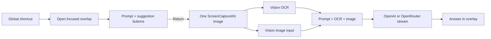

# Single-Capture SwiftUI Overlay — Prototype Design

## Goal

Build a personal macOS 26 menu-bar app that opens a compact overlay from a global shortcut, captures the current screen once, runs Vision OCR, and sends the user prompt plus both the OCR text and screenshot to an OpenAI-compatible vision model.

The prototype is intentionally narrow:

- The default shortcut opens the overlay with `Explain this question` prefilled and focused.
- Pressing Return sends the request.
- Suggestion buttons sit directly above the composer: `Explain`, `Summarize`, `Find a bug`, and `Explain concept`.
- There is no continuous screen capture, audio capture, transcription, or screenshare hiding.
- Only the current screenshot and OCR text are retained while a request is active.

The phrase “macOS 26 and updating to 7.7” is treated as macOS 26 / the current macOS 26 SDK; this is a single-user prototype, so older macOS compatibility is out of scope.

## Recommended approach

Use a SwiftUI view hosted by an AppKit `NSPanel`, with a small SwiftUI `MenuBarExtra` as the app’s entry point and settings surface.

| Approach | Tradeoff | Decision |
| --- | --- | --- |
| `MenuBarExtra` + `NSPanel` + SwiftUI | Best control over floating position, focus, key handling, and panel level while keeping the UI native | Use |
| Pure SwiftUI `Window` | Less AppKit code, but weaker control for a compact always-on-top overlay and global focus | Skip |
| AppKit panel with AppKit-only controls | Strong window control, but gives up the SwiftUI Liquid Glass component model | Skip |

## User flow

1. The app runs as a menu-bar utility.
2. `Option-Command-Space` opens or focuses the overlay on the display containing the pointer.
3. The composer contains `Explain this question` and receives keyboard focus.
4. The user may click a suggestion, edit the text, or press Return.
5. On send, ScreenCaptureKit captures one image of the active display. The app excludes its own windows from that capture so the prompt panel is not fed back to the model; it does not set any window sharing mode that hides the app from screensharing.
6. Vision runs `VNRecognizeTextRequest` over the same image.
7. The provider request includes the typed prompt, OCR text when available, and the JPEG image.
8. The response streams into the panel. A new request replaces the previous temporary image/OCR context.

## Overlay design

The panel is a borderless, floating `NSPanel` around 520 × 320 points. It can join all Spaces and participate in full-screen auxiliary windows, but it remains an ordinary capturable window.

The SwiftUI surface is a high-opacity rounded block rather than a faint translucent sheet:

- Use a tinted, near-opaque base surface for readability.
- Apply native `.glassEffect(.regular.tint(...), in: .rect(cornerRadius: ...))` to the primary surface.
- Put related suggestion controls in a `GlassEffectContainer`.
- Use `.buttonStyle(.glass)` for secondary suggestions and `.buttonStyle(.glassProminent)` for Send.
- Keep the panel content simple: header/status, optional answer area, suggestion row, composer, Send.
- Suggestions replace the composer text; they do not submit automatically.
- Return submits from the text field; Shift-Return inserts a newline.
- Use a visible focus ring and VoiceOver labels for every icon-only control.

The panel is not made screen-share-invisible. The only filtering is at capture time, where the app excludes its own window from the screenshot source.

## Capture and OCR

- Resolve the display under the pointer, falling back to the main display.
- Query `SCShareableContent` and create an `SCContentFilter` for that display, excluding the app’s own running application.
- Use `SCScreenshotManager.captureImage` for a one-shot `CGImage`.
- Encode a downscaled JPEG around 2,000–2,400 pixels wide at moderate quality to control request size and memory.
- Run `VNRecognizeTextRequest` with accurate recognition and language correction. Join observations in reading order; if OCR returns nothing, still send the image.
- Do not create an `SCStream`, timer, microphone session, or background capture loop.

The active image and OCR string are request-scoped values. They are released after the response finishes or fails.

## Provider boundary

Use `URLSession` and one small provider adapter with two request encoders:

- OpenAI: Responses API at `https://api.openai.com/v1/responses`, using `input_text` plus `input_image` and `store: false`.
- OpenRouter: OpenAI-compatible chat completions at `https://openrouter.ai/api/v1/chat/completions`, using text plus a base64 `image_url` and streaming enabled.

The adapter exposes only `send(prompt, ocrText, imageData) -> AsyncThrowingStream<String, Error>` to the UI. It owns HTTP, authentication headers, SSE parsing, and provider-specific JSON. No SDK or third-party package is needed.

Store API keys in Keychain. A minimal settings window provides provider, model, and API key fields; the prototype does not attempt to reuse a ChatGPT subscription login because ChatGPT and API billing/authentication are separate.

## Permissions and failure states

- Add `NSScreenCaptureUsageDescription` to the app metadata.
- If Screen Recording permission is missing, show a short explanation and a button to open the relevant System Settings page.
- If no API key is configured, show the settings action in the overlay.
- If OCR is empty, continue with image-only context and show no error.
- If capture, encoding, networking, or streaming fails, keep the typed prompt and show a retry action.

## Prototype boundary

Included: menu-bar lifecycle, global shortcut, focused overlay, solid Liquid Glass UI, suggestion prompts, one screenshot, Vision OCR, OpenAI/OpenRouter selection, Keychain-backed settings, and streamed answer text.

Excluded: continuous recording, audio/transcription, conversation history, local models, web search, multi-monitor preferences, cloud sync, stealth/screen-share hiding, and polished onboarding.

## Verification

The implementation should leave one runnable smoke check for the non-trivial prompt/capture path plus a short manual check:

- Shortcut opens and focuses the panel.
- A suggestion changes the prompt and Return sends it.
- One send produces exactly one screenshot request and one OCR request.
- The captured image does not contain the app’s own panel.
- OCR text and image are both present in the provider payload when OCR succeeds.
- The answer appears incrementally.
- Denied permission and missing-key states are actionable.

